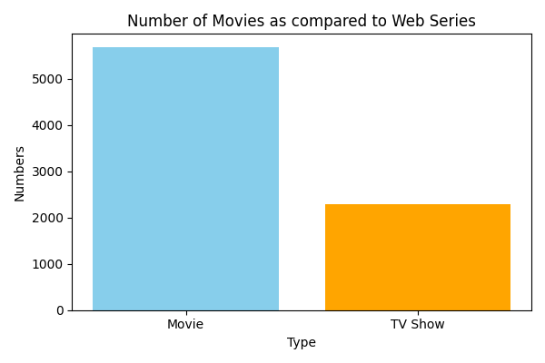
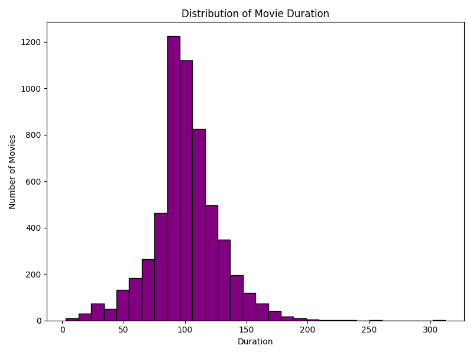
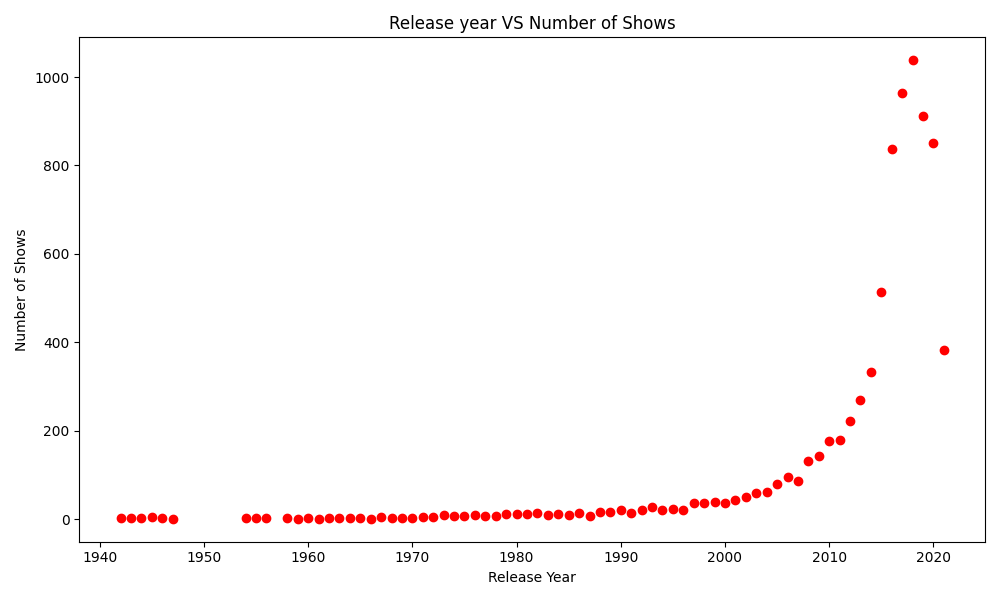
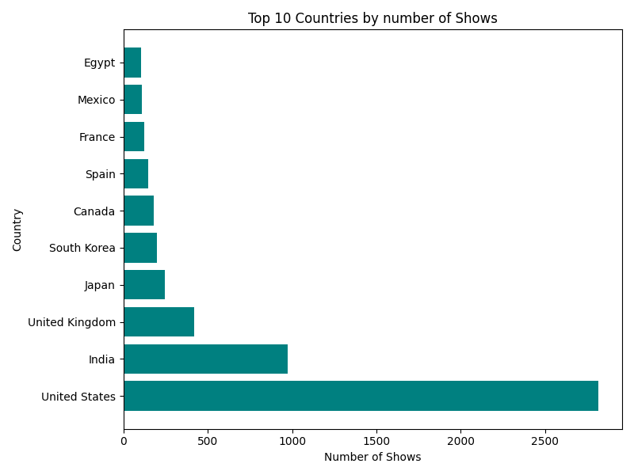
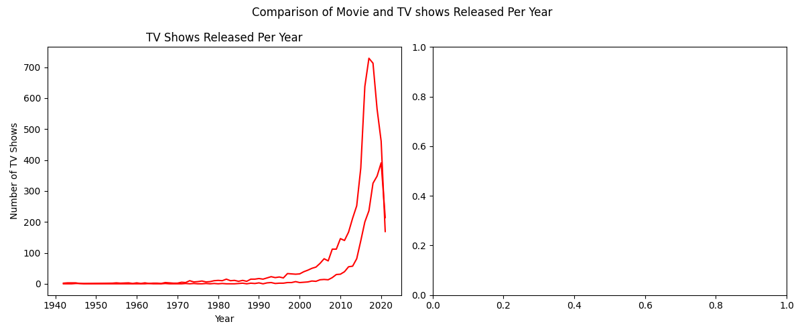

# Netflix Data Analysis & Visualization

This project explores the **Netflix Movies & TV Shows dataset** from Kaggle using **Pandas** and **Matplotlib**.  
It focuses on understanding Netflix’s content trends through **data cleaning, analysis, and visualization**.  

## 📊 Visualizations & Insights  

### 1️⃣ Number of Movies vs Web Series  
  
*Bar graph showing that Netflix has more Movies than Web Series, indicating a movie-dominant catalog.*  

### 2️⃣ Percentage Content Rating Distribution  
  
*Pie chart showing that most Netflix titles fall under **TV-MA**, meaning Netflix focuses heavily on mature content.*  

### 3️⃣ Distribution of Movie Duration  
  
*Histogram showing most Netflix movies range between **90–120 minutes**, the standard movie length.*  

### 4️⃣ Release Year vs Number of Shows  
  
*Scatter plot showing Netflix’s rapid content growth after **2015**.*  

### 5️⃣ Top 10 Countries by Number of Shows  
  
*Horizontal bar graph showing that the **US and India** dominate Netflix’s content catalog.*  

### 6️⃣ Movies vs TV Shows Released Per Year  
  
*Subplot comparing yearly release trends — while movies dominate overall, TV shows are steadily increasing, showing Netflix’s growing investment in series.*  

## 🛠️ Tech Stack  
- **Python 3.x**  
- **Pandas** – Data cleaning & analysis  
- **Matplotlib** – Visualizations  

---

## 📂 Dataset  
- Source: [Netflix Movies & TV Shows (Kaggle)](https://www.kaggle.com/shivamb/netflix-shows)  
- Format: CSV file (~8800 rows)  
- Key Columns: `type`, `title`, `director`, `cast`, `country`, `release_year`, `duration`, `rating`, `listed_in`  

